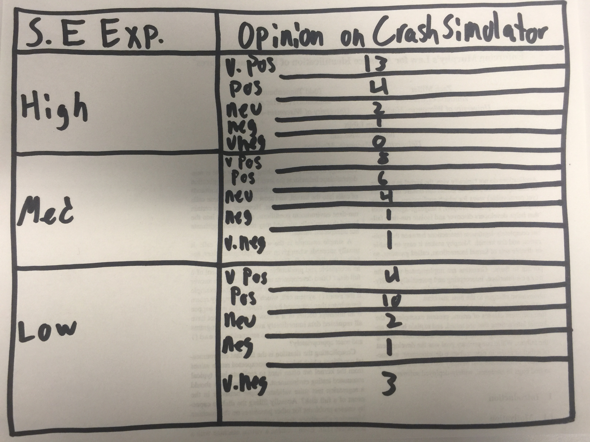

# Thesis
CrashSimulator can help identify novel bugs in real world software by simulating
and subjecting applications to the conditions that differentiate its intended
deployment environments and can be effectively used by developers of varying
skill levels.

# Abstract
*What CrashSimulator Does vs. What This Paper Does*

The sheer scale of software applications in use today, as well as a shortage of
developer time, necessitate usage of automated testing tools in combating bugs.
Today's developers can choose from a huge variety of tools with varying degrees
of complexity and bug-finding capability.  However, adopting a new tool can
result in a great deal of wasted effort if its learning curve outweighs the
value of its results.  In this work we introduce CrashSimulator -- a tool that
identifies bugs resultant from unhandled an anomalous conditions present in the
environment in which an application is executing.  CrashSimulator does this by
recording, modifying, and replaying the results and side effects of the system
calls an applications makes.  In order to demonstrate that CrashSimulator is
worthy consideration by developers regardless of skill level this work compares
it to two similar tools (AFL and Mutiny) in a study of developer's ability to
use the tools in question to find novel bugs in real world applications.  To
facilitate this comparison we conducted a study with ZZZ users in which
participants were asked to use the tools in question to hunt for bugs in
popular, real-world applications.  This study revealed that CrashSimulator's
strategy of identifying bugs visible in system call sequences is effective and
usable for developers with diverse backgrounds, across skillsets like software
engineering backgrounds.  Developers with a high degree of proficiency with
operating systems concepts preferred CrashSimulator's ability to target unusual
environmental conditions over manipulating applicaiton data inputs.  Our
participants reported that CrashSimulator's additional setup complexity was
dramatically outweighed by its ability to find new bugs.  This study was
responsible for the identification and reporting of YYY novel bugs, ZZZ of which
have been since been corrected.  With wider use CrashSimulator could help
uncover a great deal of previously unidentified bugs in new and existing
codebases.

# Introduction
Complex systems require automated testing...

The strategy for carrying out this testing must have certain properties in order
to be successful in testing large scale, modern applications...

Reliance on experts and human-in-the-loop strategies don't scale... [Alvaro]

Reliance on application source code dramatically limits the scope of what can be
tested...

Even if a tool satisfies the above requirements, its usefulness is dependant on
the quality of its output...

Tools that produce a high number of false positives are quickly deemed
untrustworthy [CITE THAT ONE PAPER]

Tools that fail to identify (or worse, misidentify) the source of bugs with
sufficient detail lead to wasted time and and effort...
(i.e. Fuzzing appication inputs can show that a bug is present but cannot
identify the code responsible for the bug.)

A tool that can more specifically map a failure to the responsible code speed up
the bug fixing process...

At the same time,  if output is too detailed developers of varying skill levels
may have trouble utilizing it...

In this paper we want to show that CrashSimulator is able to assist developers
of varying skill levels in identifying bugs bugs in real world applications.
Additionally, we show that CrashSimulator provides value in mapping the presence
of these bugs to the units of code responsibile for them allowing developers to
fix them in a more timely manner.

CrashSimulator's effectiveness comes its ability expose applications to unusual
environmental conditions that can cause problems with an application's
execution.  CrashSimulator's built-in set of anomalous conditions allows its
users to define which conditions to test an application against allieviating the
need for the expert knowledge required to set up and test an application in the
chosen environments.

CrashSimulator also allows application misbehavior to be localized to a sequence
of system calls allowing the true source of a bug to be more quickly identified
easing the process of correcting it.  This is an advantage over tools that
simply indicate the presence of a bug (i.e.  this input caused a crash)

To validate these claims we conducted a study with ZZZ participants consisting
of Master's computer science students with varying backgrounds and
specializations.  We asked these participants to test existing popular
applications (as ranked by Debian's Popularity Contest) using each of the tools.
From this work we collected both quantitative results in terms of numbers of
bugs identified and qualitative results about the tools' user experince through
surveys.

## Contributions This paper make the following contributions:
1. We illustrate that CrashSimulator is useful and usable by developers with a
   wide variety of backgrounds.
2. We show that CrashSimulator allows these developers to find real bugs in real
   applications.
3. We demonstrate that CrashSimulator compares favorably against similar
   automated testing tools in the number of bugs found and in user opinion on
   usefulness of the tools' output.

# Background

### AFL
AFL is a file-based fuzzer.  It is able to take an input file, mutate its
contents, and pass the file along to the application under test.  AFL is able to
manipulate the contents of files only while CrashSimulator is able to
maniupluate other aspects present in the results and side effects of system
calls.

### Mutiny Fuzzer
Mutiny fuzzer is a network fuzzer operates by mutating and replaying pcap
recordings of network activity.  The similarities between the operation of
Mutiny and CrashSimulator mean that it is a good candidate for comparison.  The
major difference between these two that CrashSimulator can manipulate aspects of
system calls than the messages sent across a network.  Mutiny, on the other
hand, is limited to manipulating the content of messages only.

# Evaluation
*Limitation -> Will users be able to identify what caused the problematic system
call sequence -> Add this to evaluation*

Our goal with this work was to gain an undestanding of how CrashSimulator's user
exprience compared to other tools and techniques available to developers...

Because CrashSimulator is able to to test a wide domain of operations an
appliation can peform we felt it necessary to compare it with two separte tools,
one that test based on files and one that tests based on network activity.
Specifically, we used AFL and Mutiny...

## Method

We gathered a group of YYYY participants from a computer science master's
program.  These students had varying background in relation to software
development and automated testing.  These students all received AAA hours of
education on each of these tools.  This education focused on the tools' initial
setup, configuration, usage, and how to interpret the tools' results.  BBB of
the students had used AFL in previous course work.  None of the students had
previous experience with Mutiny or CrashSimulator.

The 20 participants in this study received instruction on the configuration and
usage of the above tools as well as CrashSimulator.  We asked these users to
test popular real-world applications with the goal of identifying new bugs and
reporting them to the application's developers.  In performing this task our
participants had to correctly set up and configure each of the tools, execute a
testing process, evaluate the results, and produce sufficient proof of validity
for each bug that a convincing case for fixing it can be made.  Each of these
steps is an opportunity for gaining insight into how CrashSimulator stacks up
against other tools.

We used 3 techniques to capture the experience of our participants as they used
each of the tools.  For quantitative concerns we examined the time required for
participants to carry out defined tasks relevant to the process of bug hunting.
To do this, we asked users to track the time required to perform each step of
the process of finding and reporting a bug.

We also captured hard counts of bugs identified by our particpants using each of
the tools.  The specifics of these bugs will be discussed in more detail......

For Qualititative concerns we gathered participant impressions on the tools in
use via surveys.  These surveys were strucured to give insight into how
CrashSimlator compares to the other tools in three areas:
* Usability of the tool. (i.e. set up, configuration, executing tests,
  interpretring results)
* Extending the tool through the creation of additional anomalies and checkers
* How well the tool is able to test the areas of an application that they are
  interested in

Additionally, we asked our partipants to rate their own experience level in
software development, software testing, and operating systems concepts so that
we might determine whether or not an individual's background has an effect on
what tools they prefer.  Our hope was that this information would provide
insights into how a participants background affected their expriences with the
tools.

In this evaluation we set out to answer the following questions using both the
qualitiative and quantitative data collected during our study.

1. Are users able to effectively find bugs using CrashSimulator?  How does
CrashSimulator compare to other tools in this area?

2. How well does CrashSimulator allow users to test the areas of applications
   they are interested in?  Are other tools able to better evaluate these areas?

3. Does CrashSimulator allow its users to construct a test suite efficiently?  How
does CrashSimulator compare to similar tools efficiency wise?

4. Does user experience level have an impact on tool experience?  Is there a
difference in the skillsets required in order to be effective with
CrashSimulator vs the other tools?

5. Does CrashSimulator provide output that is useful in locating and fixing
bugs?

---

## Are users able to effectively find bugs using CrashSimulator?

For any testing tool or technique the primary concern is whether or not it is
useful for finding bugs.  To evaluate this concern in CrashSimulator's case we
need to answer whether or not CrashSimulator's users are able to effectively
find bugs using the tool....

### Findings

Table 1 contains counts of bugs identified broken down by the tool used to
identify them and self reported developer experience level with Operating
Systems concepts. A total of !!!!15!!!! bugs were found using CrashSimulator
with the majority coming from participants with a self-reported high degree of
operating systems experience.  Participants with a moderate and low degrees of
operating systems experience found more bugs AFL.....

### Discussion

The above results indicate that, when it comes to using CrashSimulator, having
experience with operating systems concepts is very beneficial...  That said,
users with a self-reported low degree of experience with OS concepts were able
to identify bugs using CrashSimulator's built in corpus of anomalies and
checkers...  Table 2 illustrates which of these checkers were most
effective......

### Discussion on Specific Bugs

!!!Discussion!!!

## How well does CrashSimulator allow users to test the areas of applications they are interested in?

Modern applications typically consist of many different parts (e.g. user
interfaces,  back-end processing, storage, networking) that require different
skill sets to work with.  These different application areas also require
different strategies for testing.  For example, Some application areas such as
graphical user interfaces are notoriously difficult cover depending on the tools
and techniques being used.  These difficulties usually result from limitations
in the way the testing tool interacts with the application being tested. We
wanted to know whether or not CrashSimulator was able to effectively test the
areas of applications its users were interested in testing.  To answer this
question we turn to the surveys our participants completed regarding their
experience with CrashSimulator.

### Findings

The results from our surveys indicate that our participants self-reported
backgrounds have an effect on the areas of an application they tested...

Developers with a high degree of experience in software engineering tended to
focus on testing an applications interaction with various library and operating
system provided APIs.  Survery results indicate participants were satisfied with
CrashSimulator's ability to test application's interaction with file and and
network APIs....

Developers with a lower self-reported experience in software engineering focused
more on user interface level concerns...  Preferred AFL's ability to easily
supply a file to be processed to an application....

### Discussion

Findings indicate that a higher level of software development experience tends
to push participants towards testing interfaces between modules in an
application.  This resulted in overall higher satisfaction with CrashSimulator
amongst participants.....

Users with less self-reported software engineering experience expressed some
concern with CrashSimulator's limitations around testing the user facing aspects
of applications.  For example, CrashSimulator requires more up front effort than
 effort than tools like AFL when conducting simple tests such as mutating the
 properties of an input file.....

## Does CrashSimulator allow its users to construct a test suite efficiently?

Constructing a test suite using CrashSimulator involves identifying new
anomalies to be tested for and creating the mutators and checkers required to
test an application's response to it.  There is no direct comparison to this
process in AFL...  Mutiny allows users to specify which messages should be
mutated and replayed....

### Findings

Developers reported a high degree of satisfaction with regard to the speed of
setup for AFL.  Participants felt like CrashSimulator required an overall higher
intitialy outlay of effort before testing could begin.  Additionally, they
indicated that expanding a CrashSimulator test suite by implementing new
checkers and mutators was more difficult that either expanding the scope of
fuzzing with AFL or instructing Mutiny to mutate different messages from a
recorded network session.  Participants felt that CrashSimulator allowed for
more specific testing and were pleased with the ability of CrashSimulator tests
to be used across multiple applications with minimal additional effort once they
had been constructed......

### Discussion

!!!!Discussion!!!!

## Does CrashSimulator require significant skills to be useful?

A user's background can dramatically influence their user experience with a
tool.  In answering this question we hope to ascertain whether CrashSimulator
requires its users have significant skills in a particular area in order to be
effective.  Table 2 compares our participants self-reported skillsets
to their positive or negative experiences with CrashSimulator...

### Findings

As can be seen in Table 2, a strong background in operating systems
concepts correlates with a more satisfactory user experience with
CrashSimulator....

Interestingly,  some participants that reported less background in operating
systems had a positive experience with CrashSimulator.  These participants
relied more heavily on built in anomalies/checkers/mutators....

### Discussion

Given the level with which CrashSimulator interacts with applications, it is not
surprising that users with significant operating systems backgrounds are better
able to utilize the tool's more advanced features....

It is encouraging to see that users with less os background had success with the
tool.  Based on this, we believe it is likely that CrashSimulator could be
successfully adopted by real-world teams whose members have diverse background
skillsets.  Users that are more comfortable with the concepts CrashSimulator
relies on can supply new testing materials as needed and other users can rely on
CrashSimulators portable nature to use these tests against new applications
without having to worry about their implementation details.

## Does CrashSimulator provide output that is useful in locating and fixing bugs?

### Findings

Developer feedback across the board indicated that CrashSimulator's output made
it easier to identify bugs than the simpler crash reports provided by AFL and
Mutiny.  This impression is backed up by the results in Table 3 that show a
higher percentage of bugs identified with CrashSimulator were fixed than bugs
identified with the other tools....

### Discussion

There are two reasons, other than output quality, that bugs found with
CrashSimulator were more likely to be fixed -- bug "depth" and the ease with
which a bug can be fixed.  It is possible that, because CrashSimulator focuses
on a lesser targeted area of an application, more easily fixed, low hanging
fruit style bugs were identified compared to the more battle tested user input
handling codepaths that AFL and Mutiny tend to explore.  Additionally, many of
the bugs types identifiable with CrashSimulator arise because of a minor missing
check meaning that the fix is small and easily incorporated....
